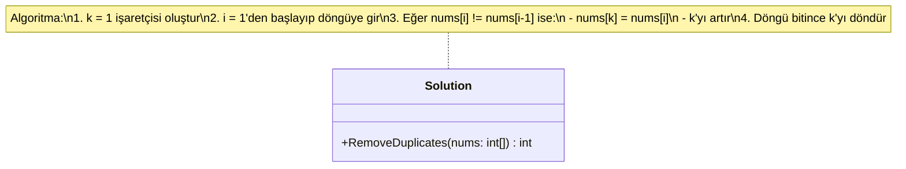

```mermaid
classDiagram
    class Solution {
        +RemoveDuplicates(nums: int[]) int
    }
    
    note for Solution "Algoritma:\n1. k = 1 işaretçisi oluştur\n2. i = 1'den başlayıp döngüye gir\n3. Eğer nums[i] != nums[i-1] ise:\n   - nums[k] = nums[i]\n   - k'yı artır\n4. Döngü bitince k'yı döndür"
```