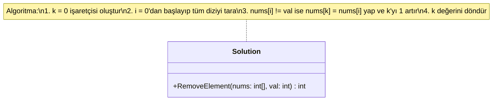

```mermaid
classDiagram
    class Solution {
        +RemoveElement(nums: int[], val: int) int
    }

    note for Solution "Algoritma:\n1. k = 0 işaretçisi oluştur\n2. i = 0'dan başlayıp tüm diziyi tara\n3. nums[i] != val ise nums[k] = nums[i] yap ve k'yı 1 artır\n4. k değerini döndür"
```